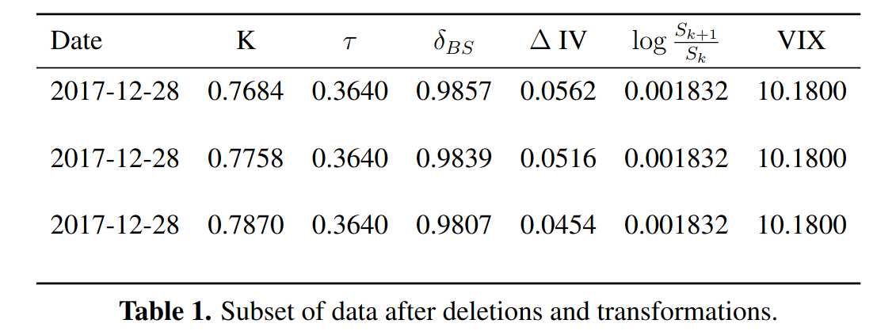

# CAN NEURAL NETWORKS SMILE? 
### EXPLORING IMPLIED VOLATILITY MOVEMENTS USING DEEP LEARNING
### *Applied Quantitative Finance Seminar*

Authors: Jonathan Baker and Feodor Doval

Discussed by: Sabina Georgescu, Konrad Müller

---
# Overview

1. Context
2. Contributions
3. Criticism

---
# 1. Context

---
# Motivation: Minimum-Variance Hedging

* **Delta-hedging options** in the BS paradigm generally fails to minimise the hedging portfolio's variance, due to a non-zero correlation between the underlying's price and volatility movements

* **MV $\delta$**: Accounts for both to achieve **minimum variance** in the **hedging position**:

$$\delta_{MV} := \argmin_{\delta} \textrm{Var}\left(\Delta f - \delta \Delta S\right)$$

* **Hull & White** (2017, appx. A) approximation: 
$$\delta_{MV} \approx \delta_{BS} + \nu_{BS} \frac{\partial E[\sigma_{imp}]}{\partial S}$$

$\therefore\quad$ Find $\delta_{MV}$ by estimating $E[\Delta \tau_{imp}]$ (**expected change in IV**).

---
# Estimating Expected Changes in IV
Proposed estimation models for $E[\Delta \sigma_{imp}]$ from the **literature**:
  * **Hull and White** (2017, benchmark), 3-parameter model:

$$\mathbb{E}\left[\sigma_{imp}\right] = \frac{a+b\cdot \delta_{BS}+c\cdot 
\delta^2_{BS}}{\sqrt{T}}\cdot\frac{\Delta S}{S};$$

   * **Cao et al.** (2018, replicated), **Deep Learning** 3(4)-factor model with NN features: 

$$\frac{\Delta S}{S}, \delta_{BS}, \tau, (\text{VIX}).$$

Relative model forecasting comparison: **hedge performance** metric.

---
# Replication

* Results firmly reinforce previous research: **3 \& 4-factor DL models outperform HW**

* Substantially **smaller gain** of the **4-factor on the 3-factor model**

* **Unstable DL models**: $\delta_{BS}<0.1$ or $\delta_{BS}>0.9\Rightarrow$ extremely inflated $E[\Delta\sigma_{imp}]$ 

* **Sparse ATM data**: potential cause of **ill-baheved predictions**

$\therefore\quad$ The **predictive accuracy** over the standard model is in line with the literature, yet overshadowed by a **lack of robustness**.

---
# 2. Contributions

---
# IVS Approach

**SVI Model** (Gatheral 2004): Deterministic function $\sigma_{SVI}(K,\tau)$ allows the fitting of an arbitrage-free IVS for strikes with $\log(\frac{K}{S})>0.5.$ $\quad\Rightarrow$ **temporal-strike grid of IVs.**

**IVS Approach** (new): 
*  Sparsely available $(K,\tau)^{raw}$ $\rightarrow$ fiited grid points $(K,\tau)^{SVI}$;
 * Option quote $\delta_{BS}$ feature $\rightarrow$ moneyness proxy $\frac{K}{S}$ feature.

$\therefore\quad$ 
$$\left(\frac{\Delta S}{S}, \delta_{BS}, \tau^{raw}, \text{VIX}\right) \mapsto (\Delta\sigma_{imp})^{raw} \quad \underset{by}{\stackrel{replaced}{\longrightarrow}} \quad \left(\frac{\Delta S}{S}, \frac{K^{SVI}}{S}, \tau^{SVI}, \text{VIX}\right) \mapsto (\Delta\sigma_{imp})^{SVI}. $$ 

---
# IVS Approach: Results

* Slightly **smaller gain over HW** than the **4-factor DL model**
* *But* **more robust** even though the IVS grid features only $21\times21$ points
* Key driver of the **IV change direction** is the **VIX level** with **returns** acting as a **scaling/translation factor**, whereas Cao et al. show evidence of the **converse**

___
# 3. Criticism

---
# General Feedback 

We commend your chosen topic of research and rephrased setting for fitting the IVS. While re-purposing prioir knowledge on $\sigma_{imp}$ as features in a DNN is not *entirely* new: 
* **Gatheral \& Jacquier** (2014) notably use the **SVI parameters** as features for the IVS;
* **Zheng et al.** (2021) incorporates **trained IVs** in the **activation functions** of the DNN that fits the IVS,

using the **fitted spatiotemporal grid of strikes and time-to-maturities** certainly *is* original, and addressses the pervasive problem of option data sparsity. 

___
# Lookahead Bias

*"It is assumed that each observation is independent of the other observations"*

* $\Delta\sigma_{imp}$ is modelled as a **function** of $\left(\frac{\Delta S}{S}, \delta_{\mathrm{BS}}, \tau, (\text{VIX})\right)$
* Two of these features are **identical** for these observations $\rightarrow$ clearly *not* independent
* Attempting to **eliminate time dependencies** in a financial TS defeats the purpose
* **Randomly sampling** the observations for the train-test split leads to **lookahead bias** 

---
# Target Encoding & Lookahead Bias

* Consider neighbouring IV observations $\sigma_t$ and $\sigma_{t+n}$ for some $n \in \{1, 2, 3, 4\};$ 
* Construct target variables:
 $$\Delta \sigma_{t+n} := \frac{\sigma_{t+n} - \sigma_t}{n} $$
that might divert significantly from the realised (unobserved) values:
E.g. $\sigma_t = \sigma_{t+2} \nRightarrow \sigma_t = \sigma_{t+1}$ in reality;
* Other features $\left(\frac{\Delta S}{S},\delta_{BS}, \tau, \text{VIX}\right)$ will be quite similar;
* Those artificial observations are then randomly split into train \& test sets:

E.g. Worst case, $n = 4:$ Train on targets $\{\Delta \sigma_t, \Delta \sigma_{t+4}\}$ and test on $\{\Delta \sigma_{t+1}, \Delta \sigma_{t+3}\}.$
$\therefore\quad$ **Lookahead bias** for an option, from training on different options at the same time.

---

# Suggestions

* Follow **Hull \& White** (2017): *eliminate target encoding* by only considering data points (options) with *prices available on successive days*

* On Cross-Validation \& Lookahead Bias: 
    * *At least*: split data into train, validation, and test *periods* (no shuffling and avoiding any leakage);
    * *Better*: repeat the above using *rolling windows*, w/ or w/o a fixed origin;
    * *Alternatively*: consider *CV techniques* that are *not just *Walk-Forward** methods, but specialised to minimise biases, say by deleting overlapping periods (purging, embargo, ...) - see e.g. **De Prado** (2018)

---

# Questions 

* **Hull \& White** (2017) filter out options with $\delta_{BS} \leq 0.05$ and  $\delta_{BS} \geq 0.95$. Did you consider this as a potential solution to avoid the reported "explosions"?

* **ITM options** are usually **illiquid**, as one might as well trade in the underlying. Why did your data set consist mainly in deep OTM \& deep ITM options?
